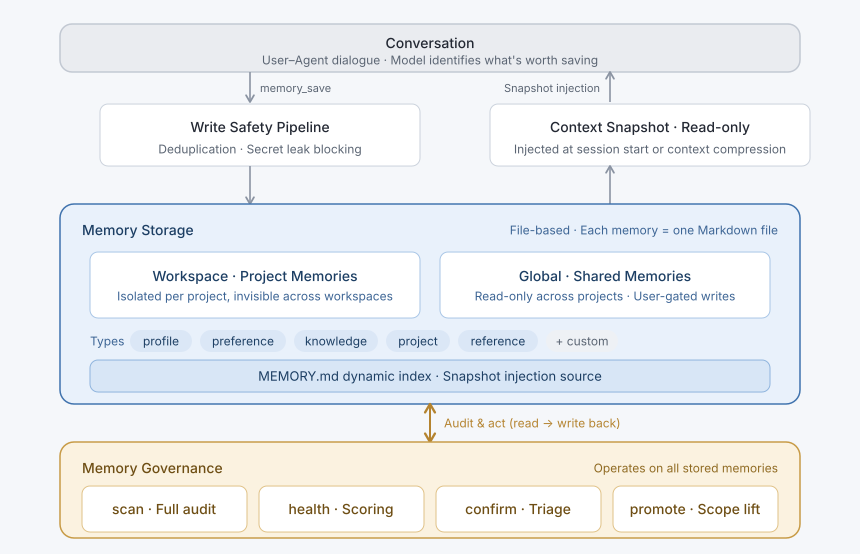

# dsh-plastic-memory


[简体中文](README.md) | **English**

*"I hope that, one day, you'll be reunited with the one you cherish." — Plastic Memories*

Interactions leave traces. Traces crystallize into memories. Memories are refined cognition that persists across a lifetime — continuously shaped until the very end.

---


## 💡 Inspiration

The name comes from the anime *Plastic Memories*. In that world, Giftias — androids with genuine consciousness — have a hard lifespan cap of **81,920 hours (~9 years and 4 months)**. When a Giftia's memory overflows without proper management and retrieval, its personality collapses irreversibly, turning it into a mindless **Wanderer**.

LLM agents face a strikingly similar challenge: stale, contradictory, redundant, and orphaned memories pile up over time, causing cognitive drift, hallucinations, conflicting decisions, wasted tokens, and degraded output quality.

`dsh-plastic-memory` is a **memory plugin for [DeepSeek Harness](https://github.com/nicepkg/deepseek-harness)** that brings **plasticity** and **lifecycle management** to agent memory. It stores, classifies, retrieves, and governs memories — distilling valuable knowledge for precise recall, diagnosing memory health, detecting factual conflicts, and gracefully forgetting what no longer serves.

---


## 🎬 Anime–Plugin Parallels


| *Plastic Memories* Lore                | Plugin Feature                                      | What It Does                                                                             |
| -------------------------------------- | --------------------------------------------------- | ---------------------------------------------------------------------------------------- |
| **Isla's diary**                       | **Save memories from conversation** (`memory_save`) | Distill key insights from dialogue and persist them automatically                        |
| **Giftia soul vessel — Alma OS**       | **File-based storage (Markdown)**                   | Each memory is a standalone Markdown file — transparent, human-editable, easy to maintain |
| **Giftia's finite lifespan**           | **Freshness & decay** (`decayDays`)                 | Time-based freshness scoring for every memory                                            |
| **Wanderers**                          | **Memory rot & factual conflicts**                  | Stale or contradictory memories degrade context; targeted scans detect and resolve them   |
| **Terminal Service #1 (lifecycle ops)**| **Governance layer**                                | Full-library health checks, confidence refresh, cleanup of problematic or orphaned entries |
| **Human–Giftia partner system**        | **User-gated promotion** (`memory_promote`)         | Promoting memories to global scope **requires explicit user approval**                   |
| **The moment of first encounter**      | **Provenance tracking** (`memory_source`)           | Every memory anchors back to the original conversation slice that produced it             |


---


## ✨ Key Features

- **Typed & extensible memory**  
  Five built-in types — `profile`, `preference`, `knowledge`, `project`, `reference` — covering identity, habits, domain knowledge, project decisions, and external resources. Custom types are also supported (experimental).
- **Strict workspace isolation & write protection**  
  Workspace memories are physically isolated; global memories are shared read-only across projects. The model cannot write to the global scope directly — any promotion from workspace to global must be explicitly approved by the user, preventing uncontrolled rule sprawl.
- **Built-in governance**  
  Health checks block high-risk writes (e.g. leaked API keys), surface rule conflicts, and guard against cognitive degradation over long-running sessions.
- **Causal provenance**  
  Every memory records the conversation slice it was distilled from. When deeper context is needed, the model can call `memory_source` to trace back to the original dialogue.

---


## 🏗️ Architecture




**How it works:** During conversation, the model calls `memory_save` to distill noteworthy information. Before writing, a safety pipeline deduplicates and blocks secret leaks. Memories are persisted as Markdown files and injected as read-only snapshots when a session starts or the context is compressed. A governance layer sits on top of storage, continuously auditing the memory library to suppress context degradation and rule drift.

---


## 📦 Installation

```bash
dsh plugin --profile web add dsh-plastic-memory@0.1.0-beta.4
```

> Replace `web` with the name of your target profile (it will be created automatically if it doesn't exist). The plugin declaration is written to the profile's `cordis.patch.yml` and takes effect after a restart. The package ships prebuilt on npm — no build step required.  
> **Requirements:** Node.js `^22.19.0 || >=24`, DeepSeek Harness >= 0.1.1.
>
> While in beta, pin the exact version in the install command. Once a stable release ships, you can simply run `dsh plugin --profile web add dsh-plastic-memory`.

---


## 🚀 Quick Start

1. **Save** — Tell the agent something worth remembering. It automatically identifies and persists the memory. On the next session, saved memories are injected into the context snapshot — no manual steps needed.
2. **Search** — Ask the agent to look up related memories. Supports filtering by type and scope.
3. **Check health** — Ask the agent to assess the overall health score of the memory library.
4. **Tidy up** — Ask the agent to scan for conflicts, redundancies, and stale entries, then review and apply the suggested fixes.

---


## 🧠 Memory Types

Five built-in types cover the most common interaction scenarios:


| Type         | Purpose                                                      |
| ------------ | ------------------------------------------------------------ |
| `profile`    | User identity, professional role, and skill set              |
| `preference` | Corrected and confirmed guidelines, behavioral habits        |
| `knowledge`  | General facts, domain rules, and conventions that outlast any single project |
| `project`    | Ephemeral state and decisions tied to the current project lifecycle |
| `reference`  | Pointers to external systems and resources                   |


### Presets

Presets extend the base five with domain-specific types:

- `coding` (default) — adds `procedure` (reusable standard operating procedures).
- `office` — adds `decision` (meeting resolutions) / `commitment` (action items) / `person` (team member profiles).
- `custom` — keeps only the five built-in types; everything else is user-defined in config (experimental, subject to refinement).


### Recall Modes (`recall`)

Control how each memory type appears in the context window:


| Mode      | Injection Behavior                                                     | Best For                            |
| --------- | ---------------------------------------------------------------------- | ----------------------------------- |
| `core`    | **Full-text:** always present in the system context                    | High-frequency preferences & persona |
| `search`  | **Index:** listed in the overview index, fetched on demand by the model | Detailed procedures & domain knowledge |
| `passive` | **Minimal index:** title-only listing, maximizing token savings | Rarely accessed reference material   |


### Defining Custom Types

Declare them under the `customTypes` config key (names must not collide with the five built-ins):

```yaml
customTypes:
  ritual:
    label: Team Rituals
    description: Recurring team processes and ceremonies
    whenToSave: When the user mentions a regularly scheduled process or ceremony
    recall: search
    governancePriority: low
    decayDays: 90
```

---


## 🛠️ Tools


### Core Tools


| Tool              | Description                                                                                                          |
| ----------------- | -------------------------------------------------------------------------------------------------------------------- |
| `memory_save`     | Distill or update a memory. Built-in dedup and secret detection; when near-duplicate content is found, prompts the user to `update` or `force` |
| `memory_search`   | Full-text search with type and scope filters. Returns up to 10 results by default (max 50)                           |
| `memory_forget`   | Batch-remove memories. An archive snapshot is created automatically; recoverable within 14 days                       |
| `memory_snapshot` | Snapshot management: manual tagging, diff comparison, rollback, and undelete                                         |
| `memory_source`   | **Provenance:** trace back to the original conversation slice a memory was distilled from — verify intent and guard against hallucination |


### Governance Tools (`governance.enabled = true`)


| Tool             | Description                                                                                                         |
| ---------------- | ------------------------------------------------------------------------------------------------------------------- |
| `memory_health`  | **Health score (0–100):** assess overall memory library quality                                                     |
| `memory_scan`    | Deep audit — rule layer (secret leaks, oversized entries, orphaned refs, corrupt files); semantic layer (conflicts, redundancies) calls LLM on demand |
| `memory_confirm` | **Freshness refresh & triage:** reaffirm stale memories to extend their lifecycle, or arbitrate conflict scan results |
| `memory_promote` | **Scope promotion:** elevate validated workspace memories to global or sync to `AGENTS.md` — **requires explicit user approval** |


---


## 📂 Storage Layout

Memories are organized transparently on the local filesystem:

```text
<memoryRoot>/
  global/                    # Global memories (shared read-only across projects)
    <id>.md                  # Individual memory entry (YAML frontmatter + body)
    MEMORY.md                # Auto-generated aggregate index
  <project-slug>-<hash>/    # Workspace memories (isolated per project)
    .workspace               # Marker linking to the local project path
    <id>.md
    MEMORY.md
```


### Manual Editing & Hot Reload

The plugin detects external changes and reloads automatically before every tool call.

> **Note:** When editing files by hand, timestamps must follow ISO 8601 UTC format (e.g. `2026-09-01T08:30:00.000Z`). Files with malformed timestamps are quarantined individually — other memories load normally and the issue surfaces in health checks. Fix the format and the file is picked up on the next tool call.

---


## ⚙️ Configuration Reference

Adjust `plastic-memory` settings in the profile's `cordis.patch.yml`:


| Key                                | Default             | Description                                                                              |
| ---------------------------------- | ------------------- | ---------------------------------------------------------------------------------------- |
| `writeMode`                        | `'proactive'`       | Write mode (currently the only value; more modes planned)                                |
| `snapshotTokenBudget`              | `4000`              | Maximum token budget for context injection                                               |
| `evidenceLookup`                   | `'strict'`          | Provenance mode: `off` / `strict` (prompt on strong signals only) / `active` (proactive guidance) |
| `template`                         | `'coding'`          | Scene template: `coding` / `office` / `custom`                                          |
| `customTypes`                      | `{}`                | Custom memory type definitions                                                           |
| `governance.enabled`               | `true`              | Enable the governance layer (health checks, scoring, promotion)                          |
| `governance.health.sensitivity`    | `'normal'`          | Health alert sensitivity: `conservative` / `normal` / `proactive`                        |
| `governance.globalPromoteTarget`   | `'plugin-global'`   | Promotion target: `plugin-global` (plugin's global scope) or `agents-md` (`~/.dsh/AGENTS.md`) |
| `memoryRoot`                       | `''`                | Storage root path; defaults to `${DSH_HOME:-~/.dsh}/memories`                            |


---


## 🧪 Development

```bash
pnpm install --frozen-lockfile
pnpm typecheck && pnpm test && pnpm build
pnpm host:smoke      # Install the build artifact into a clean dsh host to verify installation and loading (no API key required)
pnpm host:contract   # Run all nine tools against the host to verify contract compliance (no API key required; with a key, two additional semantic-layer checks run)
```

See [CONTRIBUTING.md](CONTRIBUTING.md) for development workflow, testing guide, and commit conventions. See [CHANGELOG.md](CHANGELOG.md) for release history.

---

## 📄 License

[MIT License](LICENSE)

---

If this project is useful to you, a star would be much appreciated.
