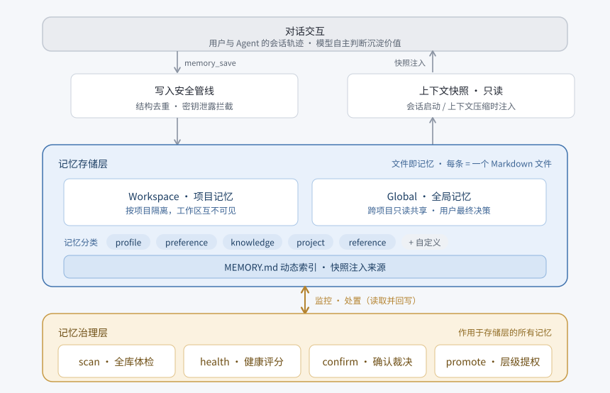

# dsh-plastic-memory


**简体中文** | [English](README.en.md)

*「愿你有一天，能与珍爱之人再次相逢。」——《可塑性记忆》*

互动产生轨迹，轨迹沉淀为记忆。记忆是历经提炼的认知结晶，贯穿生命周期，持续塑形，直至最后一刻。

---


## 💡 灵感来源

插件取名灵感源自动画《可塑性记忆》（*Plastic Memories*）。在原作中，拥有独立心智的 Giftia 寿命被严格限制在 **81,920 小时（约 9 年 4 个月）**。若记忆容量超载且缺乏妥善管理与回收，Giftia 的人格便会发生不可逆的崩溃，异化为失去理智的**「徘徊者（Wanderer）」**。

在 LLM 时代，智能体（Agent）的长期记忆系统同样面临着类似的工程挑战：过期、矛盾、冗余与孤立的记忆不断堆积，导致 Agent 认知漂移、产生幻觉与决策冲突，造成 Token 浪费与输出质量退化。

为此，`dsh-plastic-memory` 作为一款基于 [DeepSeek Harness](https://github.com/deepseek-ai/deepseek-harness) 的 **Agent 记忆插件**，提供记忆的存储、分类、检索与治理，赋予 Agent 记忆**可塑性（Plasticity）与生命周期（Lifecycle）**：既能提炼沉淀、精准唤起，也能诊断健康、判定事实冲突、适时遗忘。让有价值的共识历久弥新，让失效的信息有序退场。

---


## 🎬 设定对照


| 《可塑性记忆》世界观设定             | `dsh-plastic-memory` 功能对应                | 作用价值                                |
| ------------------------ | ---------------------------------------- | ----------------------------------- |
| **艾拉的日记**                | **对话中沉淀记忆（**`memory_save`**）**           | 从日常对话与任务中提炼记忆点，自动写入保存               |
| **Giftia 的灵魂载体 Alma OS** | **文件即记忆（Markdown）**                      | 每条记忆为一个标准 Markdown 文件，透明、可编辑、便于维护管理 |
| **Giftia 的心智寿命**         | **记忆保质与衰退机制 (**`decayDays`**)**          | 引入基于时间维度的记忆新鲜度                      |
| **徘徊者（Wanderer）**        | **记忆矛盾与事实冲突（Memory Rot）**                | 陈旧与相互矛盾的记忆会干扰上下文，支持针对性扫描并处置      |
| **第 1 终端服务（回收业务）**       | **记忆治理层（**`Governance`**）**              | 全库记忆体检、置信度刷新、清理问题记忆与孤立节点            |
| **人机搭档协作制**              | **用户与 Agent 协同提权（**`memory_promote`**）** | Global 全局记忆与跨作用域提升**必须由用户显式确认**    |
| **最初相遇的节点**              | **记忆溯源（**`memory_source`**）**            | 每条记忆均锚定原始对话切片，出处可查可追溯          |


---


## ✨ 核心特性

- 🗂️ **记忆分类与可扩展**  
内置 `profile` / `preference` / `knowledge` / `project` / `reference` 五类，覆盖身份、习惯、知识、项目决策与资源指南，分类保存、按需召回。同时支持扩展自定义分类（测试功能）。
- 🛡️ **严格的工作区隔离与写入保护**  
工作区（Workspace）记忆相互物理隔离，互不可见；全局（Global）记忆跨项目只读共享。模型无权直接写入全局域，任何项目记忆提升到全局必须由用户确认，避免全局规则无序扩张与污染。
- 🩺 **内建多层治理体系（Governance）**  
配备记忆体检机制，阻断高危信息写入（如 API 密钥），治理规则冲突，防止长期运行带来的认知退化。
- 🔍 **精确的因果溯源（Traceability）**  
每条记忆沉淀时均锚定原始会话轨迹切片。深入分析时，模型可调用 `memory_source` 回溯对话原始背景。

---


## 🏗️ 架构概览




**工作流简述：** 对话中模型触发 `memory_save` 提炼有效记忆节点，写入前通过安全管线去重并拦截密钥泄露。记忆保存为 Markdown 文件，在会话启动或上下文压缩时以只读快照形式精准注入。存储层之上叠加治理层，持续读取并处置记忆库，抑制上下文退化与规则漂移。

---


## 📦 安装

```bash
dsh plugin --profile web add dsh-plastic-memory@0.1.0-beta.4
```

> 把 `web` 换成你的目标 Profile 名即可（若该 Profile 不存在则自动创建）。安装后插件声明将自动写入该 Profile 的 `cordis.patch.yml`，重启该 Profile 后生效。插件以预构建产物发布到 npm，安装不需要构建授权。  
> **运行环境要求**：Node.js `^22.19.0 || >=24`，DeepSeek Harness ≥ 0.1.1。
>
> 当前为 beta 阶段，安装命令直接写明版本号；发布稳定版后可直接 `dsh plugin --profile web add dsh-plastic-memory`。

---


## 🚀 快速上手

1. **保存记忆**：对话中告诉模型需要记住的内容，模型自动识别并写入；下次开启新会话时，已保存的记忆随上下文快照自动注入，无需手动操作。
2. **检索记忆**：需要回顾时，让模型搜索相关记忆，支持按类型、作用域过滤。
3. **查看健康度**：让模型检查记忆库整体健康评分，了解当前记忆质量状况。
4. **整理记忆**：让模型扫描全库，自动检出冲突、冗余、过期等问题并给出处置建议，确认后一键优化。

---


## 🧠 记忆体系

系统内置 5 类基础记忆类型，适用于所有交互场景：


| 类型 (`Type`)  | 说明                   |
| ------------ | -------------------- |
| `profile`    | 用户的个人身份、专业角色与能力画像    |
| `preference` | 经过纠正与确认的准则、行为习惯      |
| `knowledge`  | 跨越项目周期的通用事实、业务常识与规则  |
| `project`    | 与当前项目生命周期强相关的临时状态与决策 |
| `reference`  | 外部系统与资源的索引           |


### 场景扩展模板

通过配置模板可在基础 5 类之上追加领域专用类型：

- `coding`（默认）：追加 `procedure`（可复用的标准操作流程）。
- `office`：追加 `decision`（会议决议）/ `commitment`（待办承诺）/ `person`（团队人员画像）。
- `custom`：仅保留 5 类核心内置类型，其余完全由用户在配置中自定义声明（测试中，后续会进一步优化）。


### 召回注入模式 (`recall`)

控制不同记忆类型在上下文中的呈现形式：


| 模式        | 注入行为                           | 适用场景        |
| --------- | ------------------------------ | ----------- |
| `core`    | **全文注入**：常驻系统上下文               | 高频核心偏好与人设画像 |
| `search`  | **索引注入**：进入概览索引，模型按需调取         | 详细流程规范与业务知识 |
| `passive` | **静默索引**：仅在索引中呈现名称，最大化节约 Token | 低频调用的参考信息   |


### 自定义类型定义

在配置项 `customTypes` 中声明（名称不能与内置 5 类冲突）：

```yaml
customTypes:
  ritual:
    label: 团队仪式
    description: 定期执行的团队流程与规范
    whenToSave: 用户提到固定周期执行的流程或仪式时
    recall: search
    governancePriority: low
    decayDays: 90
```

---


## 🛠️ 工具集一览


### 1. 日常交互工具


| 工具                | 用途与特性                                               |
| ----------------- | --------------------------------------------------- |
| `memory_save`     | 沉淀或更新记忆。内置重复性校验与密钥嗅探，遇到近似内容时主动引导 `update` 或 `force` |
| `memory_search`   | 多维全文检索，支持按类型（Type）及作用域（Scope）过滤，默认返回 10 条（上限 50）    |
| `memory_forget`   | 记忆批量移除。删除前自动归档快照，14 天内可恢复                           |
| `memory_snapshot` | 快照管理：手动打标、差异比对（Diff）、历史版本回滚与误删恢复                    |
| `memory_source`   | **因果溯源**：回溯记忆提炼时的原始会话轨迹切片，校验记忆产生的原始意图与上下文背景，防范幻觉     |


### 2. 记忆健康治理工具（`governance.enabled = true`）


| 工具               | 用途与特性                                                                |
| ---------------- | -------------------------------------------------------------------- |
| `memory_health`  | **健康度评分（0–100）**：评估全库记忆质量                                            |
| `memory_scan`    | 全库深度体检：规则层（密钥泄露、超长、孤立引用、破损文件）；语义层（冲突、冗余）按需调用 LLM                     |
| `memory_confirm` | **保质期刷新与处置决策**：确认陈旧记忆的置信度以延长生命周期，或对冲突扫描结果进行人工仲裁                       |
| `memory_promote` | **记忆提权流转**：将验证过的项目专属记忆提升至全局（Global）或同步至 `AGENTS.md`，**必须由用户明确指令确认** |


---


## 📂 存储结构与目录规范

记忆在本地文件系统中的组织清晰透明，支持直观查看与维护：

```text
<memoryRoot>/
  global/                    # 全局记忆（跨项目共享）
    <id>.md                  # 独立记忆词条（YAML Frontmatter + 正文）
    MEMORY.md                # 自动生成的全局聚合索引
  <项目slug>-<hash>/         # 项目记忆（工作区隔离）
    .workspace               # 关联的本地绝对路径标记
    <id>.md
    MEMORY.md
```


### 手动编辑与文件热重载规范

插件具备**外部变更感知机制**，每次调用工具前均会自动校验外部修改并重载。

> ⚠️ **编辑注意事项**：  
> 手动编辑时，时间戳须保持 `2026-09-01T08:30:00.000Z` 这种 UTC 毫秒格式。格式不对的文件会单独隔离，不影响其他记忆加载，健康检查中可以看到；修正后下次调用自动重载。

---


## ⚙️ 核心配置参考

在 Profile 对应的 `cordis.patch.yml` 中调整 `plastic-memory` 配置：


| 配置项                              | 默认值               | 说明                                                           |
| -------------------------------- | ----------------- | ------------------------------------------------------------ |
| `writeMode`                      | `'proactive'`     | 写入模式（目前唯一值，后续会扩展更多模式）                                        |
| `snapshotTokenBudget`            | `4000`            | 注入上下文的最大 Token 预算上限                                          |
| `evidenceLookup`                 | `'strict'`        | 证据溯源模式：`off`（关闭） / `strict`（仅强信号提示） / `active`（主动引导）         |
| `template`                       | `'coding'`        | 预设场景模板：`coding` / `office` / `custom`                        |
| `customTypes`                    | `{}`              | 自定义记忆类型定义字典                                                  |
| `governance.enabled`             | `true`            | 是否启用主动治理层（体检、健康分、提权）                                         |
| `governance.health.sensitivity`  | `'normal'`        | 健康警报灵敏度：`conservative` / `normal` / `proactive`              |
| `governance.globalPromoteTarget` | `'plugin-global'` | 提权目标：`plugin-global`（插件全局域）或 `agents-md`（`~/.dsh/AGENTS.md`） |
| `memoryRoot`                     | `''`              | 存储根路径，缺省为 `${DSH_HOME:-~/.dsh}/memories`                     |


---


## 🧪 开发与测试

```bash
pnpm install --frozen-lockfile
pnpm typecheck && pnpm test && pnpm build
pnpm host:smoke      # 把打包产物装进全新的 dsh 宿主，验证安装与加载（无需 API Key）
pnpm host:contract   # 在该宿主里驱动九个工具，验证宿主契约（无需 API Key；提供 Key 时额外运行语义层两项）
```

开发流程、测试说明与提交规范见 [CONTRIBUTING.md](CONTRIBUTING.md)；变更记录见 [CHANGELOG.md](CHANGELOG.md)。

---

## 📄 License

[MIT License](LICENSE)

---

如果这个项目对你有帮助，欢迎点个 ⭐ 支持一下，十分感谢。
